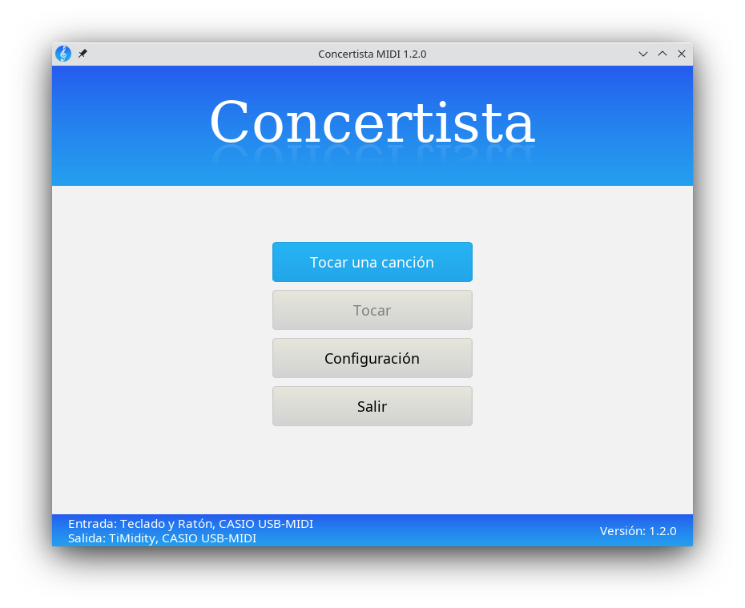
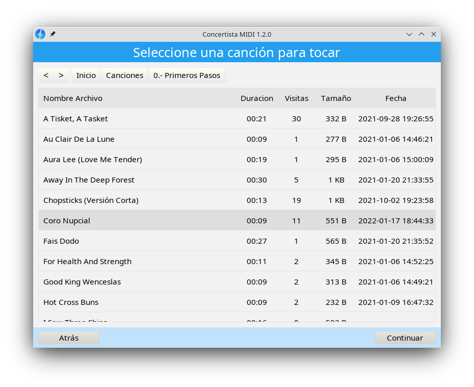
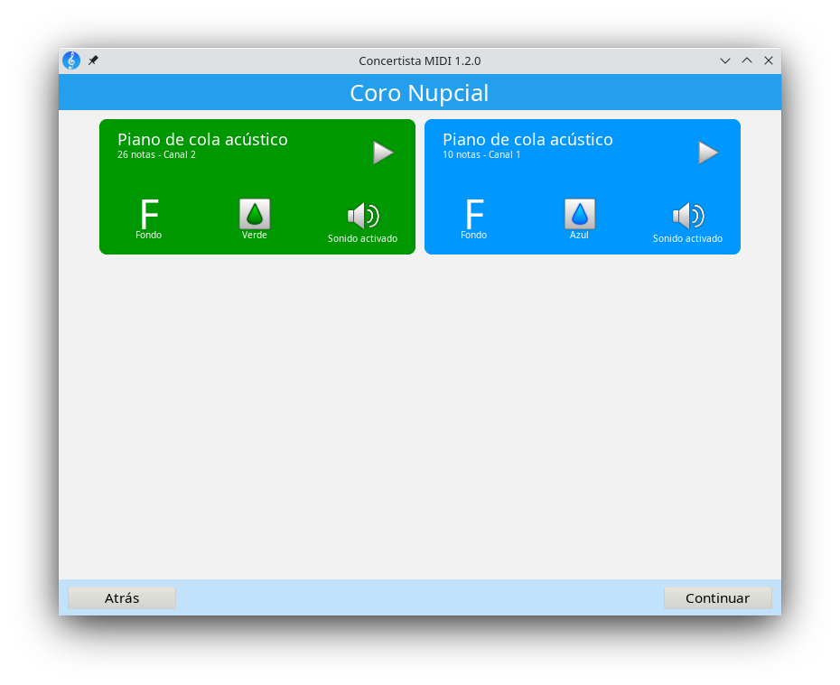
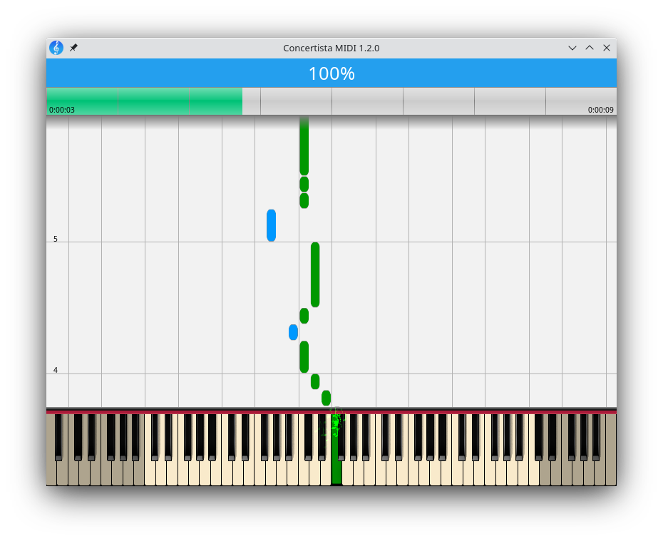

# Concertista MIDI

Concertista MIDI es un juego para aprender a tocar piano facilmente usando el teclado o el ratón de tu computador y también funciona con teclado MIDI, Concertista MIDI utiliza la libreria midi ([libmidi](https://github.com/linthesia/linthesia/tree/master/src/libmidi)) de linthesia para reproducir archivos y conectarse con dispositivos MIDI pero incluye varias mejoras como:

* Pistas independientes para archivos MIDI formato 0
* Se implemento el evento MidiMetaEvent_TimeSignature para representar correctamente canciones en compas distinto de 4/4
* El texto de los archivos midi es leido con la codificación **windows-1252** para poder representar correctamente caracteres del español como eñes y acentos
* Soporte para enviar eventos SysEx
* Varias correcciones de errores.

### Caracteristicas
* Selector de archivos
	* Navegación a traves de las carpetas configuradas
* Selector de pistas
	* Modo de juego
		* Fondo: Reproduce de forma automatica
		* Tocar: Tocado por el jugador
		* Aprender: Espera a que el jugador toque la nota correcta
	* Color de pista con 9 colores diferentes
	* Sonido
* Teclado midi completo de 128 teclas
	* Teclado de 37, 49, 61, 76, 88 teclas
	* Teclado personalisable
* Entrada
	* Organo MIDI
	* Teclado y raton
* Control de teclas luminosas
	* Canal MIDI 1-16
	* Casio LK-S250 SysEx
* Musica de entrenamiento ([de linthesia](https://github.com/linthesia/linthesia/tree/master/music/Learning))
* Reproduccion de karaoke (.kar)
* Configuración
	* Carpetas MIDI personalizadas
	* Dispositivos de entrada/salida

### Capturas

-----------

### Atajos de Teclado

|Tecla                 | Función                                                 |
|:---------------------|:--------------------------------------------------------|
|F4                    |Mostrar y ocultar Subtitulos                             |
|F5                    |Teclado de 37 teclas                                     |
|F6                    |Teclado de 49 teclas                                     |
|F7                    |Teclado de 61 teclas                                     |
|F8                    |Teclado de 76 teclas                                     |
|F9                    |Teclado de 88 teclas                                     |
|F10                   |Modo Desarrollo                                          |
|F11                   |Pantalla Completa                                        |
|F12                   |Modo Alambre                                             |
|Flecha Arriba         |Encoger notas, Subir en el navegador de archivos         |
|Flecha Abajo          |Estirar notas, Bajar en el navegador de archivos         |
|Flecha Izquierda      |Reducir velocidad, Atras en el navegador de archivos     |
|Flecha Derecha        |Aumentar velocidad, Adelante en el navegador de archivos |
|Insertar              |Desplazar Organo a la Derecha                            |
|Suprimir              |Desplazar Organo a la Izquierda                          |
|Re Pág                |Agregar una tecla al organo                              |
|Av Pág                |Eliminar una tecla al organo                             |
|Sumar (+)             |Subir volumen                                            |
|Resta (-)             |Bajar volumen                                            |
|M                     |Silencio                                                 |
|Espacio               |Pausar                                                   |
|Escape                |Atras o Salir                                            |
|Enter                 |Entrar o Continuar                                       |
|Numeros al Borrar     |Teclas negras                                            |
|Tabulador al Enter    |Teclas blancas en el organos                             |

## Requerimientos

Se requieren los siguientes paquetes para compilar concertista midi.

|Libreria    | Uso                                   |
|:-----------|:--------------------------------------|
|cmake       |Construccion                           |
|g++         |Compilación                            |
|glew        |Opengl                                 |
|libsdl2     |Sdl2 para OpenGl                       |
|glm         |Libreria de matematica para opengl     |
|freetype    |Tipografias                            |
|icu         |String Unicode                         |
|sqlite      |Base de datos                          |

### Instalar paquetes en Ubuntu

	sudo apt install g++ cmake libglew-dev libsdl2-dev libglm-dev libfreetype6-dev libicu-dev libsqlite3-dev timidity

### Instalar paquetes en Fedora

	sudo yum install g++ cmake glew-devel SDL2-devel glm-devel alsa-lib-devel freetype-devel libicu-devel sqlite-devel
(Ademas de los paquetes listados aquí tienes que instalar timidity)

### Instalar paquetes en Gentoo

	emerge --ask media-libs/glew media-libs/libsdl2 media-libs/glm media-libs/freetype dev-libs/icu dev-db/sqlite media-sound/timidity++ media-sound/fluid-soundfont

#### Configura Timidity en Gentoo

Edita el archivo

	nano /etc/timidity.cfg

Agrega lo siguiente:

	dir /usr/share/sounds/sf2
	soundfont FluidR3_GM.sf2

-----------------

## Compilación

	mkdir binario
	cd binario
	cmake .. -DTIPO_CONSTRUCCION=Liberar
	make

## Instalación

	sudo make install

### Opciones Adicionales

|Opción                      | Descripción                               |
|:---------------------------|:------------------------------------------|
|-DTIPO_CONSTRUCCION=Depurar |Permite construir la versión de depuración habilitando advertencias y la informacion de depuración para usarla con gdb o valgrind|
|-DOPTIMIZAR_NATIVO=1        |Habilita la optimización -march=native     |
|-DCONSTRUCCION_LOCAL=false  |Habilita la construccion local (no puede instalarse)|
|-PREFIJO_INSTALACION=/usr   |Cambia la ruta de instalación              |

--------------

## Ejecutar

Ya es posible ejecutar concertista midi con:

	./concertistamidi

En linux existe un dispositivo llamado **Midi Through** que no produce sonido (lo puedes encontrar en el nucleo como SND_SEQ_DUMMY), debes asegurarte que en la configuracion de Concertista MIDI este seleccionado el dispositivo de salida correcto en este caso **TiMidity**.

Para la entrada puedes configurar el **Teclado y Raton** para tocar, es compatible con el teclado MIDI Casio LK-S250.

-----------

## Creditos

### Concertista Midi

* **Carlos Barraza** Autor

### libmidi

* **Nicholas Piegdon** Autor
* **Oscar Aceña** Adaptación a Linux
* **Carlos Barraza** Nuevas Características

-----------
